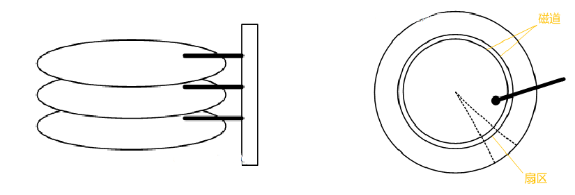
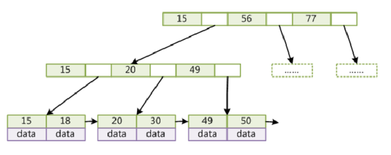
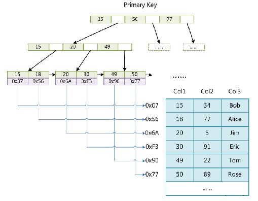

# B+tree 索引

## 概述

当前市面上大多数数据库应用 “最左前缀数据查询”都是使用`b+tree` 索引，深入了解`b+tree` 索引，有助于平常开发过程中使用的数据操作的效率提高。

## 议题

* 索引到底是什么
* 索引底层数据结构与算法
* 索引最左前缀原理
* 建立索引的时机
* 如何评估索引的效率
* 索引实际应用 `mongodb`, `mysql`

### 磁盘数据存取原理

* 寻道时间(速度慢，费时)
* 旋转时间(速度较快)
* 

https://baijiahao.baidu.com/s?id=1598412364458865169&wfr=spider&for=pc

### 索引是什么

* 索引是[数据库](https://baike.baidu.com/item/%E6%95%B0%E6%8D%AE%E5%BA%93/103728)表中一列或多列的值进行排序的一种结构，使用索引可快速访问数据库表中的特定信息

* 索引存储在文件里

* 索引结构
  * 二叉数
  * 红黑树
  * `hash`
  * `b-tree`/ `b+tree`

  ## 索引的优点

  * 减少服务器需要扫描的数量
  * 避免排序和临时表
  * 可以件随机IO 变为顺序IO

  ## 索引的缺点

  * 创建索引和维护索引需要时间成本，这个成本随着数据量的增加而加大

  *  创建索引和维护索引需要空间成本，每一条索引都要占据数据库的物理存储空间，数据量越大，占用空间也越大（数据表占据的是数据库的数据空间）

  *  会降低表的增删改的效率，因为每次增删改索引需要进行动态维护，导致时间变长

  ## 建立索引的时机

  * 越小的数据类型通常更好：越小的数据类型通常在磁盘、内存中都需要更少的空间，处理起来更快。
  *  简单的数据类型更好：整型数据比起字符，处理开销更小，因为字符串的比较更复杂，处理起来也更耗时。

  * 尽量避免NULL：应该指定列为NOT NULL。含有空值的列很难进行查询优化，因为它们使得索引、索引的统计信息以及比较运算更加复杂。你应该用0、一个特殊的值或者一个空串代替空值。

  * 对非唯一的字段，例如“性别”这种大量重复值的字段，增加索引也没有什么意义，所以索引的建立应当更多的选取唯一性更高的字段。

  # B+tree

  **定义**：数据记录节点都是按照键值大小顺序存放在同一层的叶子节点上，而非叶子节点上只存储key值信息

  * 非叶子节点不存储data，只存储key，可以增大度
  * 叶子节点不存储指针
  * 顺序访问指针，提高区间访问的性能

https://www.cs.usfca.edu/~galles/visualization/Algorithms.html

**B+Tree索引的性能分析**

* 一般使用磁盘I/O次数评价索引结构的优劣

* 预读：磁盘一般会顺序向后读取一定长度的数据(页的整数倍)放入内存

* 局部性原理：当一个数据被用到时，其附近的数据也通常会马上被使用

* B+Tree节点的大小设为等于一个页，每次新建节点直接申请一个页的空间，这样就保证一个节点物理上也存储在一个页里，就实现了一个节点的载入只需一次I/O

### 非聚集索引(`MyISAM/mongodb`)

索引文件和数据文件是分离的

### 聚集索引（`InnoDB`）

* 数据文件本身就是索引文件
* 表数据文件本身就是按B+Tree组织的一个索引结构文件
* 聚集索引-叶节点包含了完整的数据记录
* 必须有主键，并且推荐使用整型的自增主键（顺序存储）
* 非主键索引结构叶子节点存储的是主键值(一致性和节省存储空间)

[数据结构](https://www.cs.usfca.edu/~galles/visualization/Algorithms.html)

### 多列索引（最左前缀原则）

**小结：**

**count 记数慢的问题**：

* count(*)  没有查询条件时，则取数据记录的常量值会非常快，

* count(列) 没有条件，需要考虑 null 的问题（null不会有索引）

* count 当存在where 条件时， 会扫描所有满足条件的行

  #### 优化

  * 使用近似值（explain 中预测扫描行的数量）
  * 简到优化（总数 - 已知小分数据的数量）
  * 覆盖索引优化
  * 汇总表/外部缓存数量（存储数量的数据）

  #### 数据排序问题

  索引顺序，和查询数据顺序是否有影响？

  > 有影响： 

